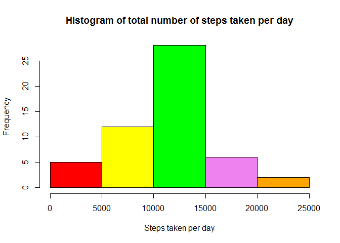

# Reproducible Research: Peer Assessment 1
#### Author: Pradeep K. Pant, ppant@cpan.org

```r
# Loading and preprocessing the data
# Load CRAN modules 
library(downloader)
library(plyr)
library(knitr)
library(datasets)
library(ggplot2)

# Step 1: Download the activity data set if not avaliable in default location
Url <- "https://d396qusza40orc.cloudfront.net/repdata%2Fdata%2Factivity.zip"
# Check if zip has already been downloaded in projectData directory?
if(!file.exists("activity.zip")){
  download.file(Url,destfile="activity.zip",mode = "wb")
  }
# Check if zip has already been unzipped?
if(!file.exists("activity.csv")){
  unzip(zipfile="activity.zip")
}

# Read the .CSV file in R data structure 
activityData <- read.csv("activity.csv")
# Remove the NA values and store in a separate structure for future use
activityDataCleaned <- activityData[complete.cases(activityData),]
```
## What is mean total number of steps taken per day?

```r
# Calculate the total number of steps taken per day
steps_taken_per_day <- aggregate(steps ~ date, activityDataCleaned, sum)
```
**1. Create a histogram of no of steps taken per day**

```r
# Just for beautification
colors = c("red", "yellow", "green", "violet", "orange", "blue", "pink", "cyan") 
hist(steps_taken_per_day$steps, col=colors, main = "Histogram of total number of steps taken per day", xlab = "Steps taken per day")
```



**2. Calculate the mean and median of the total number of steps taken per day**

```r
# disabling scientific notation in R
options(scipen = 999)
# calculate mean and median values
steps_taken_per_day_mean <- round(mean(steps_taken_per_day$steps))
steps_taken_per_day_median <- median(steps_taken_per_day$steps)
```
* Mean is **10766**
* Median is **10765**


## What is the average daily activity pattern?


## Imputing missing values


## Are there differences in activity patterns between weekdays and weekends?
