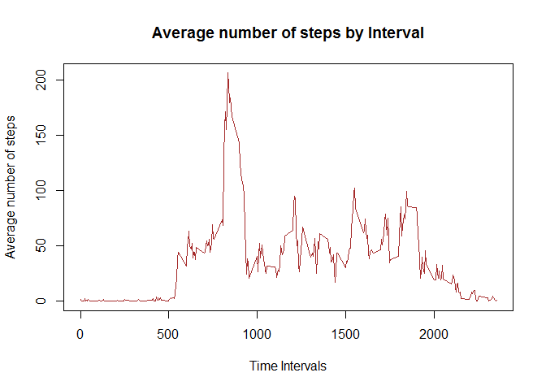
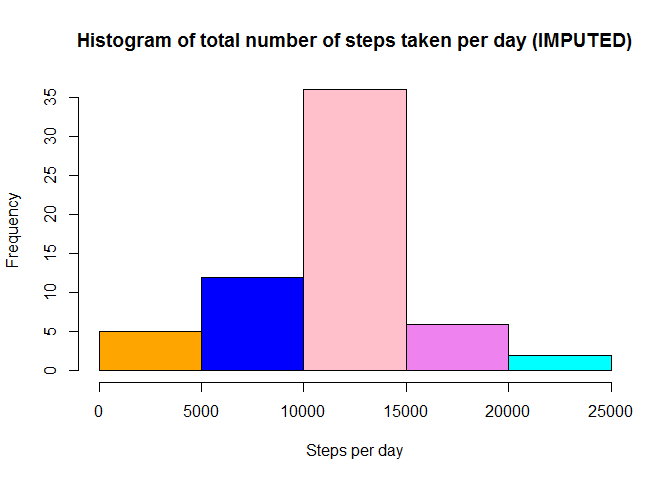
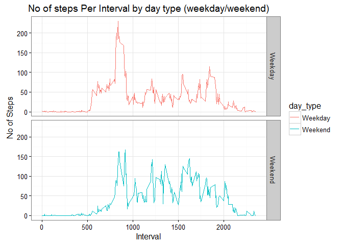

# Reproducible Research: Peer Assessment 1
#### Author: Pradeep K. Pant, ppant@cpan.org

```r
# Loading and preprocessing the data
# Load CRAN modules 
library(downloader)
library(plyr)
library(knitr)
library(datasets)
library(ggplot2)
library(rmarkdown)

# Step 1: Download the activity data set if not avaliable in default location
Url <- "https://d396qusza40orc.cloudfront.net/repdata%2Fdata%2Factivity.zip"
# Check if zip has already been downloaded in projectData directory?
if(!file.exists("activity.zip")){
  download.file(Url,destfile="activity.zip",mode = "wb")
  }
# Check if zip has already been unzipped?
if(!file.exists("activity.csv")){
  unzip(zipfile="activity.zip")
}

# Read the .CSV file in R data structure 
activityData <- read.csv("activity.csv")
# Remove the NA values and store in a separate structure for future use
activityDataCleaned <- activityData[complete.cases(activityData),]
```
## What is mean total number of steps taken per day?

```r
# Calculate the total number of steps taken per day
steps_taken_per_day <- aggregate(steps ~ date, activityDataCleaned, sum)
```
**1. Create a histogram of no of steps taken per day**

```r
# Just for beautification
colors = c("red", "yellow", "green", "violet", "orange", "blue", "pink", "cyan") 
hist(steps_taken_per_day$steps, col=colors, main = "Histogram of total number of steps taken per day", xlab = "Steps taken per day")
```


**2. Calculate the mean and median of the total number of steps taken per day**

```r
# disabling scientific notation in R
options(scipen = 999)
# calculate mean and median values
steps_taken_per_day_mean <- round(mean(steps_taken_per_day$steps))
steps_taken_per_day_median <- median(steps_taken_per_day$steps)
```
* Mean is **10766**
* Median is **10765**


## What is the average daily activity pattern?

```r
# Calculate average steps per interval for all days 
avg_steps_per_interval <- aggregate(steps ~ interval, activityDataCleaned , mean)
```

**1. Time series plot of the average number of steps taken?**


```r
plot(avg_steps_per_interval$interval, avg_steps_per_interval$steps, type='l', col="brown", main="Average number of steps by Interval", xlab="Time Intervals", ylab="Average number of steps")
```



**2. The 5-minute interval that, on average, contains the maximum number of steps?**

```r
# Identify the interval index which has the highest average steps
interval_idx <- which.max(avg_steps_per_interval$steps)
# Identify the specific interval and the average steps for that interval
interval_on_max_steps<-avg_steps_per_interval[interval_idx, ]$interval
maxStepsOnInterval<-round(avg_steps_per_interval[interval_idx, ]$steps, digits = 1)
# Print max avg interval and max steps
```
* Interval in which max steps taken **835**
* Max steps taken **206.2**

## Imputing missing values
**1. Calculate and report the total number of missing values in the dataset (i.e. the total number of rows with NAs)**

```r
# Calculate the number of rows with missing values
missing_value_act <- activityData[!complete.cases(activityData), ]
missing_value_act_count<-nrow(missing_value_act)
```

* No of missing values **2304**

**2. Devise a strategy for filling in all of the missing values in the dataset. The strategy does not need to be sophisticated. For example, you could use the mean/median for that day, or the mean for that 5-minute interval, etc.  **

```r
# Strategy is to replace the missing NA values with the average steps in that interval across all the days

# Loop thru all the rows of activity, find the one with NA for steps. 
# For each identify the interval for that row
# Then identify the avg steps for that interval in avg_steps_per_interval
# Substitute the NA value with that value

for (i in 1:nrow(activityData)) {
    if(is.na(activityData$steps[i])) {
        val <- avg_steps_per_interval$steps[which(avg_steps_per_interval$interval == activityData$interval[i])]
        activityData$steps[i] <- val 
    }
}
```
**3. Create a new dataset that is equal to the original dataset but with the missing data filled in.**

```r
# Aggregate the steps per day with the imputed values
steps_taken_per_day_impute <- aggregate(steps ~ date, activityData, sum)
```

**4. Make a histogram of the total number of steps taken each day and Calculate and report the mean and median total number of steps taken per day.**


```r
# Draw a histogram of the value 
# Just for beautification
colors = c("orange", "blue", "pink","violet","cyan","red","yellow","green") 
# create historgram
hist(steps_taken_per_day_impute$steps, col = colors, main = "Histogram of total number of steps taken per day (IMPUTED)", xlab = "Steps per day")
```



```r
# disabling scientific notation in R
options(scipen = 999)

# Compute the mean and median of the imputed value
steps_taken_per_day_mean_impute <- round(mean(steps_taken_per_day_impute$steps))
steps_taken_per_day_median_impute <- round(median(steps_taken_per_day_impute$steps))
```

#### Do these values differ from the estimates from the first part of the assignment? 

Yes, They slighly differ.

Inital values

* Mean is **10766**
* Median is **10765**

After filling up data

* Mean (IMPUTED) is **10766**
* Median (IMPUTED) is **10766**

We see that the values after filling the data mean and median are equal.  


#### What is the impact of imputing missing data on the estimates of the total daily number of steps?
Comaring the initial mean and median with the values after filling the dataset we see that mean value remain unchanged but median has shifted slightly. So I don't think it will have major impact on final prediction.


## Are there differences in activity patterns between weekdays and weekends?

**1. Create a new factor variable in the dataset with two levels - "weekday" and "weekend" indicating whether a given date is a weekday or weekend day.**
First let's make a function to check if day on given date is a weekday or not?

```r
week_day <- function(dateVal) {
    wdname <- weekdays(as.Date(dateVal, '%Y-%m-%d'))
    if  (!(wdname == 'Saturday' || wdname == 'Sunday')) {
        x <- 'Weekday'
    } else {
        x <- 'Weekend'
    }
    
}
```
Apply the function to the dataset to create a new day type variable


```r
# Apply the week_day function and add a new column to activity dataset
activityData$day_type <- as.factor(sapply(activityData$date, week_day))
```
**2. Make a panel plot containing a time series plot (i.e. type = "l") of the 5-minute interval (x-axis) and the average number of steps taken, averaged across all weekday days or weekend days (y-axis).**


```r
# Create the aggregated data frame by intervals and day_type
steps_per_day_impute <- aggregate(steps ~ interval+day_type, activityData, mean)

# Create the plot
ggplot(steps_per_day_impute, aes(interval, steps)) +
    geom_line(stat = "identity", aes(colour = day_type)) +
    theme_bw() +
    facet_grid(day_type ~ ., scales="fixed", space="fixed") +
    labs(x="Interval", y=expression("No of Steps")) +
    ggtitle("No of steps Per Interval by day type (weekday/weekend)")
```




